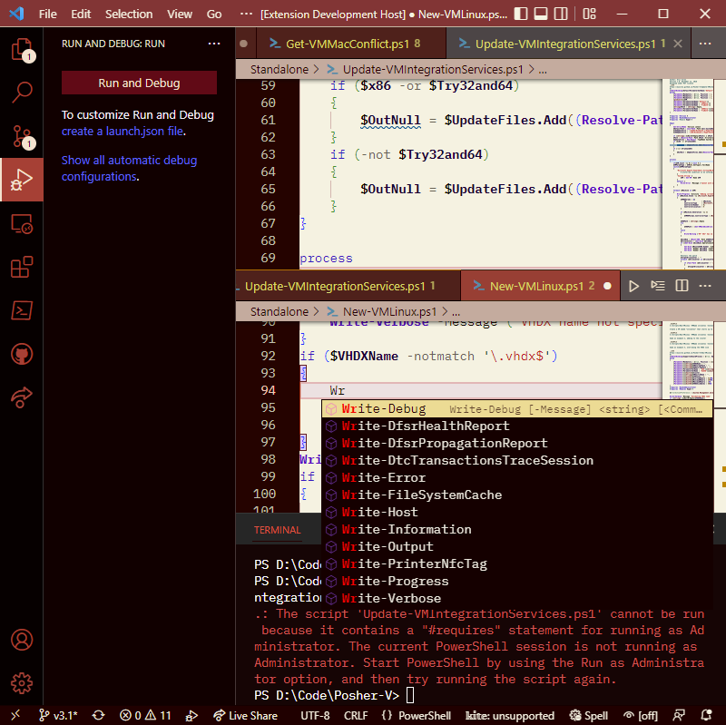

# CrimZen

A mixed color theme for Visual Studio Code. CrimZen uses a light design for the coding area with a darker style for all other regions. This design seeks to achieve a balance between the harshness of light themes and the low-contrast, washed-out bleakness of dark themes. This theme will likely look its best in rooms with high ambient lighting.

## Screenshot

## Suggested Fonts

This theme was built and tested using the [Hack](https://sourcefoundry.org/hack/), [IBM Plex Mono](https://github.com/IBM/plex/releases), and [Deja Vu Sans Mono](https://dejavu-fonts.github.io/) fonts.

## Problems

Updates have removed most of the major display problems. If you uncover any others, report on the[issues page](https://github.com/ejsiron/CrimZen/issues). Ensure that you provide reproduction steps.

## Theme Creation

Learn how to make your own theme on [the CSS Tricks site](https://css-tricks.com/creating-a-vs-code-theme/).

## Gratitude

Thank you for trying out my theme!
