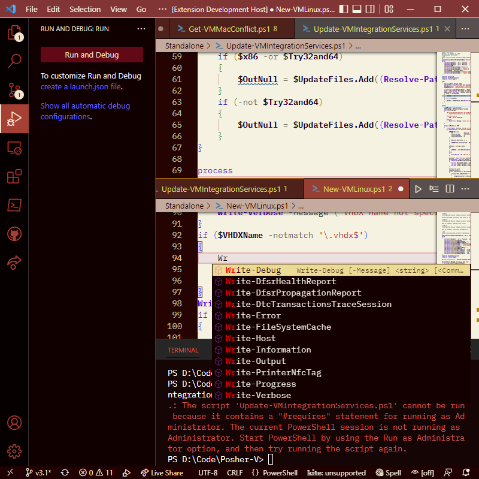

# CrimZen

A mixed color theme for Visual Studio Code. CrimZen uses a light design for the coding area with a darker style for all other regions. This design seeks to achieve a balance between the harshness of light themes and the low-contrast, washed-out bleakness of dark themes. This theme will likely look its best in rooms with high ambient lighting.

## Screenshot

## Suggested Fonts

This theme was built and tested using the [IBM Plex Mono](https://github.com/IBM/plex/releases) font. Earlier versions were also tested with [Hack](https://sourcefoundry.org/hack/) and [Deja Vu Sans Mono](https://dejavu-fonts.github.io/) fonts, which should still look just fine.

## Problems

All major problems with built-in components have been corrected. Some popular third-party extensions currently have some unfixable problems due to the way that they select colors. If you uncover any problems in native screens, report them on the[issues page](https://github.com/ejsiron/CrimZen/issues). Ensure that you provide reproduction steps.

## Theme Creation

Learn how to make your own theme on [the CSS Tricks site](https://css-tricks.com/creating-a-vs-code-theme/).
Learn how to package and publish from the [VS Code docs](https://code.visualstudio.com/api/working-with-extensions/publishing-extension).

## Gratitude

Thank you for trying out my theme!
